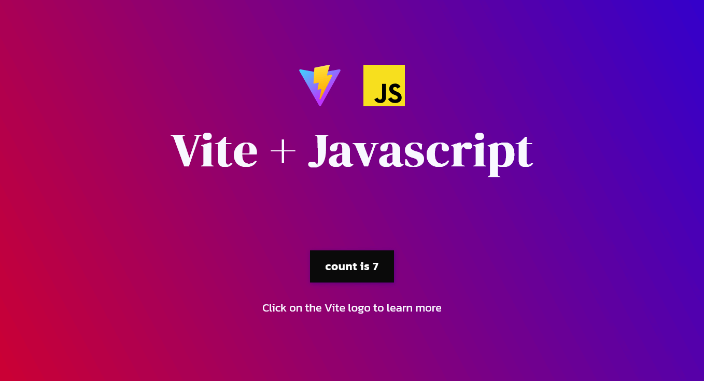
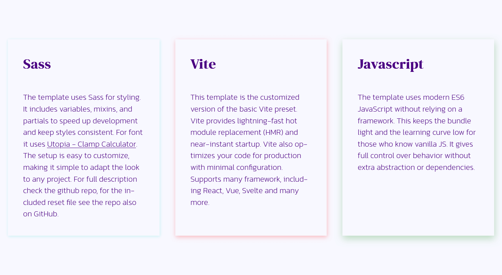
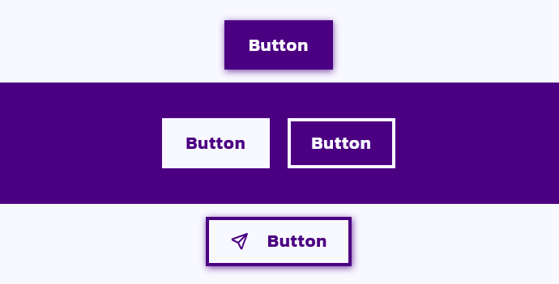

# A Sass Vite template

[Live Preview](https://mihaly-ale.github.io/vite-sass-boilerplate/)

I originally created this template to speed up the styling of simple projects.
It started with writing basic mixins to learn Sass. Later, it developed into this larger setup.

## Documentation

The template comes with built-in mixins.  
For the full list and usage and examples, see the [Sassdoc Documentation](https://mihaly-ale.github.io/vite-sass-boilerplate/sassdoc).

## Features

- Define CSS custom properties for colors, shades, font-face, box-shadow.
- Includes most CSS custom properties also as Sass variables.
- Easily register fonts using [`@mixin font-face`](https://mihaly-ale.github.io/vite-sass-boilerplate/sassdoc/#fonts-mixin-font-face).
- Uses utopia for dynamic font sizing - [see source code](https://github.com/mihaly-ale/vite-sass-boilerplate/blob/main/src/styles/scss/abstracts/_utopia.scss).
- Contains a custom CSS reset. [See the repository](https://github.com/mihaly-ale/css-reset).
- Includes [modern-normalize](https://github.com/sindresorhus/modern-normalize) from Sindre Sorhus.
- Provides a lightweight 5KB [SVG sprite](https://github.com/mihaly-ale/vite-sass-boilerplate/blob/main/src/assets/icon-sprite.svg?short_path=38676d2) with common social icons.

## Screenshots

  
  

## Getting Started

**1. Clone the repository**

      git clone https://github.com/mihaly-ale/vite-sass-boilerplate.git

**Don’t need the template styling?**

Clone the template-base branch instead:

      git clone -b template-base https://github.com/mihaly-ale/vite-sass-boilerplate.git

Then delete the `_template.scss` partial — this contains all the template-specific styles.

**2. Install dependencies**

      npm install

**3. Start the dev server**

      npm run dev

## FAQ

### Can I see the compiled CSS?

Yes, run `npm run debug:sass`. This compiles into main.css in styles/css folder. Use this during development to debug scss.

### Why my font-face rules are not compiled correctly?

Update-references parameter in `@mixin font-face`is not used correctly.
`@mixin font-face` uses the `update-preferences` tuple to register fonts.
When adding a typeface (e.g., ` MySansFont`) for the first time, use `(true, sans)` - this registers the font in the font-families map as a sans font.
For additional styles (e.g., bold, italic), use `(false, sans)`.

- See this scenario for adding five fonts.

  `@include font-face('Kanit', 'kanit-regular', 400, normal, (true, sans));`  
  `@include font-face('Kanit', 'kanit-semibold', 600, normal, (false, sans));`  
  `@include font-face('Kanit', 'kanit-extralight', 200, normal, (false, sans));`  
  `@include font-face('DMSerif', 'dmserif-regular', 400, normal, (true, serif));`  
  `@include font-face('DMSerif', 'dmserif-italic', 400, italic, (false, serif));`  

### Why my box-shadow doesn't change color?

The `--shadow-color` custom property has to be overwritten locally.
Then re-declare `box-shadow` to reflect the new color.
Use the `@mixin create-shadow-color` with a color and the correct key from the `$shadows` map, and overwrite `box-shadow` accordingly.

### What is the minimum setup to use this template?

If you want to use the template’s mixins to generate ready-to-use custom properties, check the `_root.scss` partial. It includes the mixins with a base setup and compiles to:

Compiled <code>_root.scss</code>

<pre>
   :root {
     --fs--1: clamp(0.9375rem, 0.8972rem + 0.1343vi, 1.0315rem);
     --fs-0: clamp(1.125rem, 1.0179rem + 0.3571vi, 1.375rem);
     --fs-1: clamp(1.35rem, 1.1431rem + 0.6898vi, 1.8329rem);
     --fs-2: clamp(1.62rem, 1.2672rem + 1.176vi, 2.4432rem);
     --fs-3: clamp(1.944rem, 1.3814rem + 1.8755vi, 3.2568rem);
     --fs-4: clamp(2.3328rem, 1.472rem + 2.8693vi, 4.3413rem);
     --fs-5: clamp(2.7994rem, 1.5189rem + 4.2681vi, 5.787rem);
   }

   :root {
   --ff-sans: Kanit;
   --ff-serif: DMSerif;
   }

   :root {
   --fw-slim: 300;
   --fw-normal: 500;
   --fw-thick: 700;
   }

   :root {
   --min-width: 300px;
   --content-width: 1400px;
   --sidebar-width: 300px;
   --par-min-width: 25ch;
   --par-max-width: 65ch;
   }

   :root {
   --size-1: 0.0625em;
   --size-2: 0.125em;
   --size-3: 0.25em;
   --size-4: 0.5em;
   --size-5: 0.75em;
   --size-6: 1em;
   --size-7: 1.25em;
   --size-8: 1.5em;
   --size-9: 1.75em;
   --size-10: 2em;
   --size-11: 2.5em;
   --size-12: 3em;
   --size-13: 4em;
   --size-14: 5em;
   --size-15: 6em;
   --size-16: 8em;
   --size-17: 10em;
   --size-18: 12em;
   --size-19: 14em;
   }

   :root {
   --punctuation-offset: -0.3em;
   --scroll-top-offset: 3ex;
   }

   :root {
   --clr-green: green;
   --clr-red: salmon;
   --clr-blue: blue;
   --clr-dark: indigo;
   --clr-light: ghostwhite;
   }

   :root {
   --clr-gray-10: hsl(0deg 0% 90%);
   --clr-gray-20: hsl(0deg 0% 80%);
   --clr-gray-30: hsl(0deg 0% 70%);
   --clr-gray-40: hsl(0deg 0% 60%);
   --clr-gray-50: hsl(0deg 0% 50%);
   --clr-gray-60: hsl(0deg 0% 40%);
   --clr-gray-70: hsl(0deg 0% 30%);
   --clr-gray-80: hsl(0deg 0% 20%);
   --clr-gray-90: hsl(0deg 0% 10%);
   }

   :root {
   --clr-green-10: hsl(120deg 100% 90%);
   --clr-green-20: hsl(120deg 100% 80%);
   --clr-green-30: hsl(120deg 100% 70%);
   --clr-green-40: hsl(120deg 100% 60%);
   --clr-green-50: hsl(120deg 100% 50%);
   --clr-green-60: hsl(120deg 100% 40%);
   --clr-green-70: hsl(120deg 100% 30%);
   --clr-green-80: hsl(120deg 100% 20%);
   --clr-green-90: hsl(120deg 100% 10%);
   --clr-red-10: hsl(6deg 93% 90%);
   --clr-red-20: hsl(6deg 93% 80%);
   --clr-red-30: hsl(6deg 93% 70%);
   --clr-red-40: hsl(6deg 93% 60%);
   --clr-red-50: hsl(6deg 93% 50%);
   --clr-red-60: hsl(6deg 93% 40%);
   --clr-red-70: hsl(6deg 93% 30%);
   --clr-red-80: hsl(6deg 93% 20%);
   --clr-red-90: hsl(6deg 93% 10%);
   --clr-blue-10: hsl(240deg 100% 90%);
   --clr-blue-20: hsl(240deg 100% 80%);
   --clr-blue-30: hsl(240deg 100% 70%);
   --clr-blue-40: hsl(240deg 100% 60%);
   --clr-blue-50: hsl(240deg 100% 50%);
   --clr-blue-60: hsl(240deg 100% 40%);
   --clr-blue-70: hsl(240deg 100% 30%);
   --clr-blue-80: hsl(240deg 100% 20%);
   --clr-blue-90: hsl(240deg 100% 10%);
   --clr-dark-10: hsl(275deg 100% 90%);
   --clr-dark-20: hsl(275deg 100% 80%);
   --clr-dark-30: hsl(275deg 100% 70%);
   --clr-dark-40: hsl(275deg 100% 60%);
   --clr-dark-50: hsl(275deg 100% 50%);
   --clr-dark-60: hsl(275deg 100% 40%);
   --clr-dark-70: hsl(275deg 100% 30%);
   --clr-dark-80: hsl(275deg 100% 20%);
   --clr-dark-90: hsl(275deg 100% 10%);
   --clr-light-10: hsl(240deg 100% 90%);
   --clr-light-20: hsl(240deg 100% 80%);
   --clr-light-30: hsl(240deg 100% 70%);
   --clr-light-40: hsl(240deg 100% 60%);
   --clr-light-50: hsl(240deg 100% 50%);
   --clr-light-60: hsl(240deg 100% 40%);
   --clr-light-70: hsl(240deg 100% 30%);
   --clr-light-80: hsl(240deg 100% 20%);
   --clr-light-90: hsl(240deg 100% 10%);
   }

   :root {
   --shadow-small: 1px 2px 8px var(--shadow-color, hsla(0, 0%, 0%, 0.25));
   --shadow-medium: 1px 4px 12px var(--shadow-color, hsla(0, 0%, 0%, 0.25));
   --shadow-large: 1px 8px 20px var(--shadow-color, hsla(0, 0%, 0%, 0.25));
   --shadow-drop-small: 1px 1px 2px var(--shadow-color, hsla(0, 0%, 0%, 0.25));
   --shadow-drop-medium: 2px 2px 2px var(--shadow-color, hsla(0, 0%, 0%, 0.25));
   --shadow-drop-large: 3px 3px 2px var(--shadow-color, hsla(0, 0%, 0%, 0.25));
   --shadow-inset-small: inset 1px 1px 8px var(--shadow-color, hsla(0, 0%, 0%, 0.25));
   --shadow-inset-medium: inset 1px 1px 12px var(--shadow-color, hsla(0, 0%, 0%, 0.25));
   --shadow-inset-large: inset 2px 2px 16px var(--shadow-color, hsla(0, 0%, 0%, 0.25));
   --shadow-color: hsla(274.6153846154, 100%, 25.4901960784%, 0.75);
   }
</pre>

